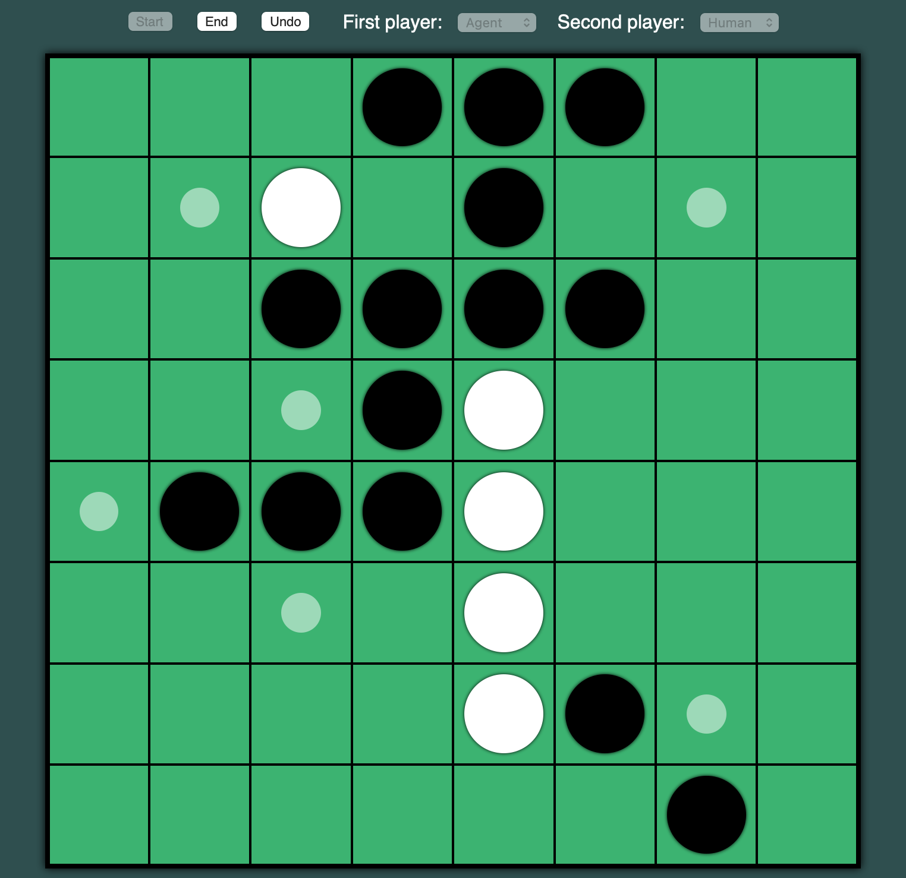

# Reversi

This repository contains an implementation of the game Reversi (a.k.a. Othello), and a game-playing agent using the minmax algorithm with alpha-beta pruning. The entire code is written in a single file `index.html`, so you can simply download it, click it open, and play.

## Features

* Playing with another human
* Playing with a game-playing agent
* Undo moves made by human players
* End a game early and start a new game

## Acknowledgement

The heuristic function used by the minmax algorithm is based on the paper *[An Analysis of Heuristics in Othello](https://courses.cs.washington.edu/courses/cse573/04au/Project/mini1/RUSSIA/Final_Paper.pdf)*. The software is open-sourced under the MIT license.

## Screenshots

Start of a human-human game:

An ongoing agent-human game:

